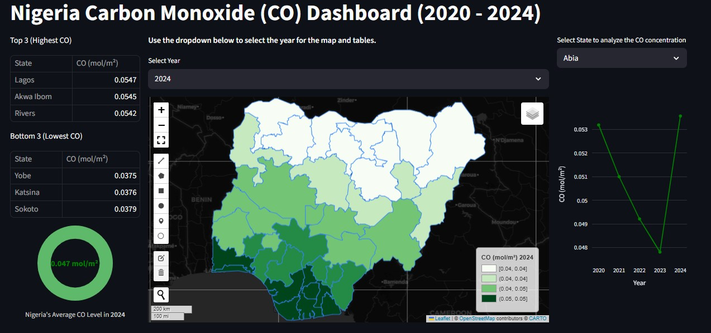

# 🌍 Nigeria Carbon Monoxide (CO) Dashboard (2020–2024)

This interactive dashboard visualizes **carbon monoxide (CO) concentrations** across Nigerian states from **2020 to 2024**.
It allows users to explore air quality patterns, identify pollution hotspots, and track changes over time.

Link to Dashboard:
https://nigeria-carbon-monoxide-dashboard-2020-2024.streamlit.app

## 🚀 Features
* 🗺️ **Choropleth Map** (Natural Breaks classification with green scale)

  * Dark-themed basemap for better visualization
  * Interactive popups showing state-specific CO levels
* 📊 **Top & Bottom States**

  * Automatically updates when a year is selected
  * Displays 3 highest and 3 lowest states
* 📈 **Time-Series Analysis**

  * Line chart showing annual variations in CO levels for each state
* 🍩 **National Average Donut Chart**

  * Displays Nigeria’s average CO concentration per year
* 📝 **Dashboard Information Modal**

  * Pops up when the dashboard loads
  * Sidebar button to view information later


## 📂 Project Structure
```
co-dashboard/
│
├── app.py              # Main Streamlit app
├── requirements.txt    # Python dependencies
├── data/
│   └── nigeria_state_co.geojson   # Input data
└── images/
    └── screenshot.png  # Example screenshot (optional)
```

## 📊 Data
* **Source:** Processed from Sentinel-5P CO dataset (2020–2024)
* **Format:** GeoJSON with state-level annual mean CO values (mol/m²)
* **Projection:** EPSG:4326 (WGS 84)

## 📸 Preview


## 🛠️ Installation
⚡ Built with **Python, Streamlit, Leafmap, Folium, Plotly, and Geopandas**.
